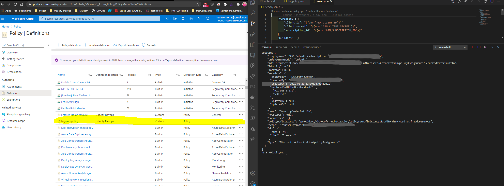
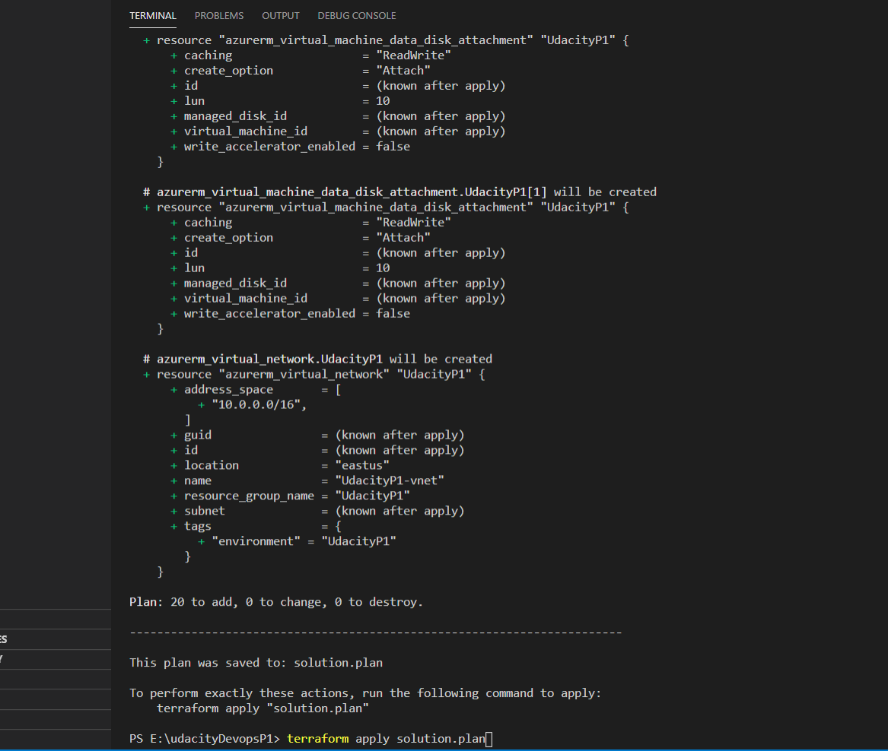
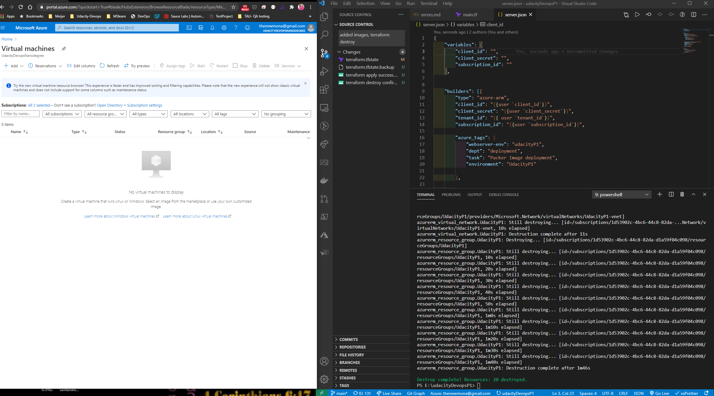

# Azure Infrastructure Operations Project: Deploying a scalable IaaS web server in Azure

### Introduction
This is my submission for the **Deploying a Web Server in Azure** project as part of the ***DevOps Engineer for Microsoft Azure*** nanodegree program from [Udacity](https://www.udacity.com/)

## [Project Rubric](https://drive.google.com/file/d/1I_PxpF4etf9D4KACkdQKknJH6ukZOUH1/view?usp=sharing) 
For this project, I wrote  a Packer template and a Terraform template to deploy a customizable, scalable web server in Azure.

### Getting Started

## 1. Clone this [repository](https://github.com/udacity/nd082-Azure-Cloud-DevOps-Starter-Code)
## 2. Update this README to reflect how someone would use my code.
**Login to Azure CLI** `as login`

### To Deploy a Server on Azure you will need to do the following:  
  *Create your infrastructure as code*    
    * Creating a Packer template    
    * Creating a Terraform template    
    * Deploying the infrastructure    
  
  ## First you will need to verify the following:  
### Dependencies
1. Create an [Azure Account](https://portal.azure.com) 
2. Install the [Azure command line interface](https://docs.microsoft.com/en-us/cli/azure/install-azure-cli?view=azure-cli-latest)
3. Install [Packer](https://www.packer.io/downloads)
4. Install [Terraform](https://www.terraform.io/downloads.html)

### Instructions

Should you have more than one Subscription, you can specify the Subscription to use via the following command:  
`$ az account set --subscription="SUBSCRIPTION_ID"`  

Do an `az account list` to show the subscription that you are using 
## Step 1: Create the Service principles for Terraform and Packer 
*For Packer:*
* Run `az account show —query "{ subscription_id: id}"`.  
* Create the following environment variable using the output of the last command: `ARM_SUBSCRIPTION_ID`  
* Run `az ad sp create-for-rbac --query "{ client_id: appId, client_secret: password, tenant_id: tenant }"`.  
* Use the output of the last comment to create the following environment variables: `ARM_CLIENT_ID and ARM_CLIENT_SECRET`.  

*For Terraform:*
* Login to your Azure account with `az login`.  
* Run `az account show`, to get the tenant id. Copy the tenant id.  
* Paste it as default =„" for tenat_id in the vars.tf file (line 1).  
* Run `terraform init`, to initialize Terraform. Successful init returns „Terraform has been successfully initialized!“  
## Step 2: Create and Apply a Tagging Policy
Create a policy that ensures all indexed resources in your subscription have tags and deny deployment if they do not.
* Write a policy definition to deny the creation of resources that do not have tags.
* Apply the policy definition to the subscription with the name `"tagging-policy`.
* Use `'az policy assignment list'` and take the snapshot of your policy.
    a. Create the policy definition :  
    `az policy definition create --name tagging-policy  --rules Policy\tagging_policy.rules.json \   --param Policy/tagging_policy.params.json`  
    b. Show the policy definition :  
    `az policy definition show --name tagging-policy`  
    c. Assign the Policy   
    `az policy assignment create --name tagging-policy --policy tagging-policy --param Policy/tagging_assignment.params.json`  
    d. Check that the Policy has been assigned:  
    `az policy assignment show --name tagging-policy` or `az policy assignment list`  
## Step 2: Create a Server Image Template
Create a server image using Packer that anyone can use and leverage in the Terraform template ensuring the following:
* Use an Ubuntu 18.04-LTS SKU as base image.
* Add the builders code in the `server.json` file provided in the starter folder.  
  **Note: This code is provided in the `server.json` template**  

`"inline":["echo 'Hello, World!' > index.html" ,`  
`"nohup busybox httpd -f -p 80 & " ], `  
`"inline_shebang" : "/bin/sh - x", "type" : "shell"`  
    
* Ensure that the resource group that you'll specify in the Packer for image is the same image specified in Terraform.

## Step 3: Create the infrastructure Terraform Template
Create the infrastructure template for the application to run on. 
Here are the main steps:  
* Create the resource group for the custom image with the following command:
`az group create --name (name) --location (region) --tags "project=(name)"`
* Create a Virtual network and a subnet on that virtual network.
* Create a Network Security Group. 
* Ensure that you explicitly allow access to other VMs on the subnet and deny direct access from the internet.
* Create a Network Interface.
* Create a Public IP.
* Create a Load Balancer. Your load balancer will need a backend address pool and address pool association for the network interface and the load balancer.
* Create a virtual machine availability set.
* Create virtual machines. Make sure you use the image you deployed using Packer!
* Create managed disks for your virtual machines.
* Ensure a variables file allows for customers to configure the number of virtual machines and the deployment at a minimum.

This project contains a `'main.tf'` file that needs to be updated with above mentioned resources to create the infrastructure template which is often referred to Infrastructure as Code [IaC](https://docs.microsoft.com/en-us/azure/devops/learn/what-is-infrastructure-as-code).

### ----------------------------------------------------------------------------------------------------

### Input Variables:
Input variables serve as parameters for a Terraform module, allowing aspects of the module to be customized without altering the module's own source code, and allowing modules to be shared between different configurations.

1. Declaring an Input Variable:
    * Each input variable accepted by a module must be declared using a variable block. 
    * The label after the variable keyword is a name for the variable, which must be unique among all variables in the same module. This name is used to assign a value to the variable from outside and to reference the variable's value from within the module.
    * The variable declaration can also include a default argument. If present, the variable is considered to be optional and the default value will be used if no value is set when calling the module or running Terraform.

2. Input Variable Documentation:
    * The purpose of each variable can be briefly described using the optional description argument.

This project contains a `'var.tf'` file to store such variables which will be referred by the Terraform infrastructure template described in the 'main.tf' file.
Variables that are stored and defined in the `'vars.tf'` are as follows:
* location
* prefix
* resource_group_name
* no_of_instances
* admin_password

### ---------------------------------------------------------------------------------------------------

## Step 4: Deploying the infrastructure
Now that your Packer and Terraform templates are written, it's time to deploy your work. Using a service principal or your own administrator account in Azure, you'll want to deploy your VM image using Packer.

Once your image is successfully deployed, you'll use Terraform to deploy your infrastructure (making sure to run `terraform plan` with the `-out` flag, and save the plan file with the name `solution.plan`) and ensure the following:

* Run `'packer build'` on your Packer template with any appropriate variable arguments  
  
  ```azurecli
    Wait completed after 8 minutes 7 seconds

  ==> Builds finished. The artifacts of successful builds are:
  --> azure-arm: Azure.ResourceManagement.VMImage:

  OSType: Linux
  ManagedImageResourceGroupName: UdacityP1
  ManagedImageName: PackerServerImage
  ManagedImageId: /subscriptions/xxxxxxxxxxxxxxxxxxxxxxxxxxx/resourceGroups/UdacityP1/providers/Microsoft.Compute/images/PackerServerImage
  ManagedImageLocation: East US```

* Run `'terraform plan` `-out solution.plan` 
* Deploy your Terraform infrastructure by running `'terraform apply'`


### Output
## Screenshot 1: Tagging Policy


## Screenshot 2: Packer Image


## Screenshot 3: Terraform Plan


## Screenshot 4: Terraform Apply


## Screenshot 5: TerraForm Destroy



### The files included are:

* [Project Images](/project-images): Folder containing the screenshots the results
* `main.tf`: File containing the Terraform infrastructure template
* `vars.tf`: File containing the variables to be used in the Terraform infrastructure template
* `server.json`: File containing the Packer image template

